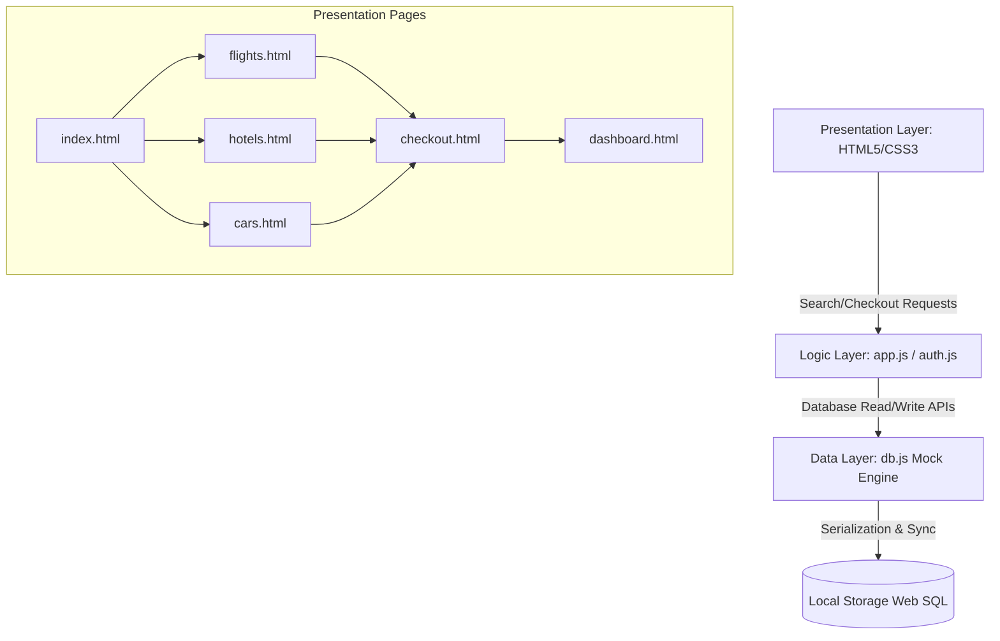
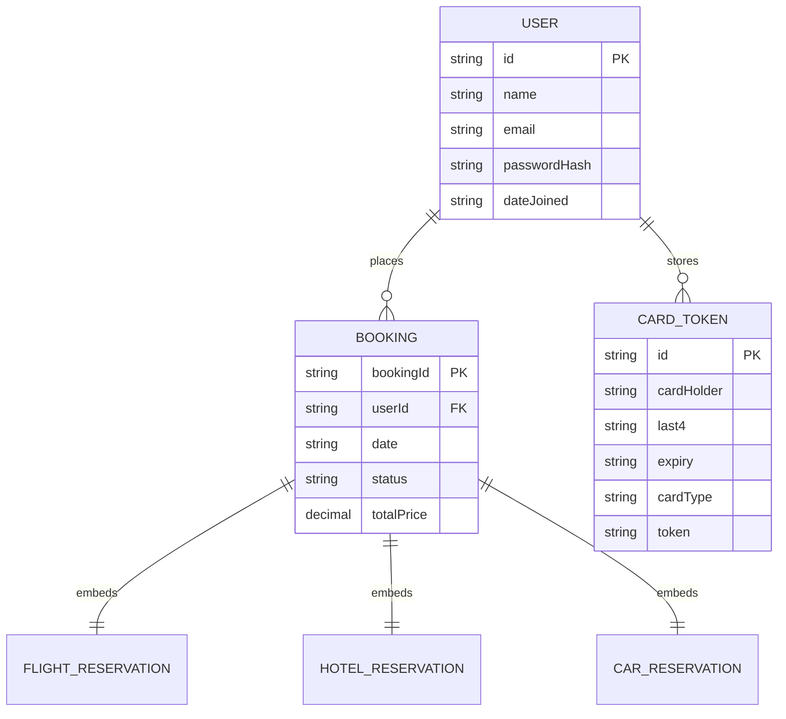
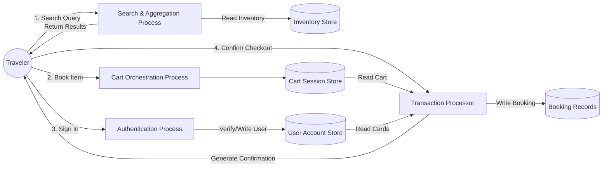

# Travel Rentals: Detailed Project Report
## Integrated Travel Booking Platform

**Project Development Team**  
*November 2025*

---

## Contents
1. **Introduction**
   * 1.1 Project Overview
   * 1.2 Scope and Objectives
2. **System Analysis and Requirements**
   * 2.1 Functional Requirements (FR)
   * 2.2 Non-Functional Requirements (NFR)
3. **System Architecture and Design**
   * 3.1 Logical Architecture Model
   * 3.2 Component Design
   * 3.3 Technology Stack
4. **Database Design and Data Modeling**
   * 4.1 Data Entities & ER Diagram
   * 4.2 Detailed Schema Description
5. **Detailed System Diagrams (UML & DFD)**
   * 5.1 Use Case Diagram
   * 5.2 Data Flow Diagram (DFD Level 1)
   * 5.3 Sequence Diagram: Booking Confirmation
6. **Implementation Methodology & Codebase Structure**
   * 6.1 Development Approach
   * 6.2 Codebase File Layout
7. **Testing and Quality Assurance (QA)**
   * 7.1 Testing Strategy
   * 7.2 Manual Verification and User Acceptance Testing (UAT)
8. **Conclusion and Future Scope**
   * 8.1 Project Conclusion
   * 8.2 Future Roadmap

---

## Chapter 1: Introduction

### 1.1 Project Overview

The **Travel Rentals** platform is developed as a comprehensive solution to the fragmented nature of the online travel booking industry. The project's central goal is to unify the distinct processes of securing car rentals, hotel accommodation, and flight tickets into a single, intuitive, and highly efficient user interface. This holistic approach significantly enhances the travel planning experience by reducing research time and minimizing the risk of booking discrepancies across different systems.

#### 1.1.1 Problem Statement
The current digital landscape for travel planning is characterized by significant inefficiency. Travelers are routinely required to visit three or more distinct vendor or aggregator websites—one for flights, one for hotels, and one for cars. This leads to:
* **High Cognitive Load**: Users must manage multiple tabs, interfaces, and price comparisons simultaneously.
* **Data Redundancy**: Personal and itinerary details must be entered repeatedly across different platforms.
* **Lack of Integration**: The inability to easily bundle or cross-reference bookings often leads to suboptimal travel arrangements (e.g., booking a flight that arrives too late for a car rental pick-up).

#### 1.1.2 Proposed Solution
Travel Rentals offers a dedicated, single point of access for all primary travel needs. The system utilizes modern web technologies and robust data aggregation to present a clear, unified view of available options, ensuring transparency and ease of use. The solution is inherently user-centric, prioritizing fast load times, mobile responsiveness, and an engaging booking flow.

### 1.2 Scope and Objectives

#### 1.2.1 Project Scope
The initial scope of the Travel Rentals platform focuses on the core functionality of booking:
* Car rentals (domestic and international).
* Hotel and accommodation reservations.
* Commercial airline ticket purchases.

*Out of Scope*: Ancillary services such as travel insurance, activity bookings, cruise line reservations, and multi-modal public transit planning are excluded from the initial iteration.

#### 1.2.2 Project Objectives
1. Develop and deploy a fully functional MVP (Minimum Viable Product).
2. Achieve seamless, unified cart management to bundle flights, hotels, and cars in a single transaction.
3. Secure payment details by implementing tokenized credit/debit card storage simulation.
4. Ensure accessibility and standard responsiveness across desktop and mobile browsers.

---

## Chapter 2: System Analysis and Requirements

### 2.1 Functional Requirements (FR)

#### 2.1.1 FR 1: User Management
* **FR 1.1**: The system shall allow users to register and create a profile.
* **FR 1.2**: The system shall provide features for profile updates (name, email) and password modification.
* **FR 1.3**: The system shall support tokenized credit/debit card association to save payment methods securely.

#### 2.1.2 FR 2: Car Rental Module
* **FR 2.1**: The system shall search for cars by location (e.g. Delhi, Mumbai, Goa, Bangalore), pickup/drop-off dates, and times.
* **FR 2.2**: The system shall filter results by vehicle class (SUV, Sedan, Hatchback), transmission (Automatic, Manual), and fuel type (Petrol, Diesel, Electric).
* **FR 2.3**: The system shall calculate the total rental cost automatically based on dates and daily base rates.

#### 2.1.3 FR 3: Hotel Booking Module
* **FR 3.1**: The system shall search for hotels by destination, check-in/check-out dates, and number of guests.
* **FR 3.2**: The system shall filter hotels by star ratings and specific amenities (Pool, Gym, Spa, Beach Access).
* **FR 3.3**: The system shall display hotel-specific rooms lists with pricing and add rooms to the cart.

#### 2.1.4 FR 4: Flight Booking Module
* **FR 4.1**: The system shall search for flights based on origin, destination, dates, and travel class (Economy, Business, First Class).
* **FR 4.2**: The system shall display layovers, airline codes, and real-time status (On Time, Delayed).
* **FR 4.3**: The system shall allow users to enable real-time price tracking, notifying the user dynamically when ticket prices fluctuate.

#### 2.1.5 FR 5: Transaction and Confirmation
* **FR 5.1**: The system shall process checkout transactions using saved token cards or a new card.
* **FR 5.2**: The system shall compile detailed booking confirmations containing dynamic unique receipt IDs.
* **FR 5.3**: The system shall provide a dashboard to view active/past bookings and print formal travel vouchers.

### 2.2 Non-Functional Requirements (NFR)

* **Performance**: Search results must update instantly on the client side, maintaining page transitions under 200ms.
* **Security**: Enforce secure credential simulation and tokenized payment structures using client-side sandboxed local storage to ensure no raw numbers are stored.
* **Usability**: Conforms to WCAG 2.1 Level AA contrast guidelines, featuring a premium glassmorphic UI with CSS transitions and a dedicated printable print-sheet layout.

---

## Chapter 3: System Architecture and Design

### 3.1 Logical Architecture Model

The platform is designed around a **Three-Tier Logical Model** containing:
1. **Presentation Layer**: HTML5 documents ([index.html](file:///c:/Users/narge/OneDrive/Documents/project/Web-Pages/travel-rentals/index.html), [flights.html](file:///c:/Users/narge/OneDrive/Documents/project/Web-Pages/travel-rentals/flights.html), etc.) styled using custom CSS3 properties ([style.css](file:///c:/Users/narge/OneDrive/Documents/project/Web-Pages/travel-rentals/css/style.css)) providing interactive fields.
2. **Logic Layer**: JavaScript controllers ([app.js](file:///c:/Users/narge/OneDrive/Documents/project/Web-Pages/travel-rentals/js/app.js) and [auth.js](file:///c:/Users/narge/OneDrive/Documents/project/Web-Pages/travel-rentals/js/auth.js)) managing calculations, session validation, filters, and notification systems.
3. **Data Layer**: Mock database engine ([db.js](file:///c:/Users/narge/OneDrive/Documents/project/Web-Pages/travel-rentals/js/db.js)) using `localStorage` for persistent JSON document storage.



### 3.2 Component Design

The platform uses modular JavaScript modules to decouple core features:
* **`DB Controller`**: Performs CRUD queries on LocalStorage tables, filters inventory items, and generates flight schedules dynamically based on route hashes.
* **`Auth Controller`**: Coordinates session variables, handles validation logic, and securely tokenizes credit cards using unique ID hashes.
* **`App Controller`**: Evaluates date changes, keeps navbar cart counts updated, and triggers periodic background price-change toast notifications.

### 3.3 Technology Stack
* **Frontend**: Pure HTML5 (Semantic elements) and CSS3 (Custom Variables, Flexbox, Grids, media print layouts).
* **Programming Logic**: Vanilla ECMAScript 6+ JS (No heavy node runtime dependencies needed to compile/build).
* **Mock Database Layer**: HTML5 Web Storage API (`localStorage` JSON tables).

---

## Chapter 4: Database Design and Data Modeling

### 4.1 Data Entities & ER Diagram

The database structure relies on JSON document schemas. The entities include:
1. **User**: Credentials, joining info, and tokenized payment card credentials array.
2. **Booking**: The transaction bundle containing booking ID, totals, and embedded items (Car, Hotel, Flight).
3. **Flight / Hotel / Car Inventory**: Pre-cached reference items returned by search parameters.



### 4.2 Detailed Schema Description

#### 4.2.1 User Document Schema
```json
{
  "id": "usr_1715694212",
  "name": "John Doe",
  "email": "john@example.com",
  "passwordHash": "john123",
  "dateJoined": "04/06/2026",
  "paymentCards": [
    {
      "id": "card_1715694300",
      "cardHolder": "JOHN DOE",
      "last4": "4444",
      "expiry": "12/28",
      "cardType": "Visa",
      "token": "tok_visa_k8a2jd"
    }
  ]
}
```

#### 4.2.2 Booking Document Schema
```json
{
  "bookingId": "TR-9J2KD9S7A",
  "userId": "usr_1715694212",
  "date": "04/06/2026",
  "status": "Confirmed",
  "totalPrice": 14750,
  "flight": {
    "id": "flight_6e_105",
    "airline": "IndiGo",
    "code": "6E-105",
    "from": "DEL",
    "to": "BOM",
    "date": "2026-06-05",
    "seatClass": "Economy",
    "price": 4500
  },
  "hotel": {
    "id": "hotel_beachfront",
    "name": "Resort De Goa & Spa",
    "location": "Goa",
    "checkIn": "2026-06-05",
    "checkOut": "2026-06-07",
    "nights": 2,
    "roomType": "Standard Room",
    "price": 10000
  },
  "car": null
}
```

---

## Chapter 5: Detailed System Diagrams (UML & DFD)

### 5.1 Use Case Diagram

The primary actors are the **Traveler** (Customer accessing the frontend) and the **System Controllers** (mediating mock logic).

```mermaid
usecaseDiagram
  rect rgba(2, 132, 199, 0.05)
    Traveler --> (Search Flights)
    Traveler --> (Search Hotels)
    Traveler --> (Search Cars)
    Traveler --> (Add Items to Cart)
    Traveler --> (Register/Login)
    Traveler --> (Settle Payment / Checkout)
    Traveler --> (Print Booking Vouchers)
    Traveler --> (Toggle Price Alert Alerts)
  end
```

### 5.2 Data Flow Diagram (DFD Level 1)

DFD Level 1 decomposes the booking process showing how search, cart, user, and transaction databases exchange data.



### 5.3 Sequence Diagram: Booking Confirmation

Illustrates the time-ordered calls made when a traveler completes checkout.

```mermaid
sequenceDiagram
    actor Client as Traveler Browser
    participant App as app.js Controller
    participant Auth as auth.js Session
    participant DB as db.js Mock DB
    database LS as Local Storage

    Client->>App: Click 'Pay & Confirm'
    App->>Auth: Verify current User state & Saved Card Token
    Auth-->>App: Return User verified card tok_visa_xxxx
    App->>DB: Send Booking payload (Flight + Hotel + Car details)
    DB->>DB: Compute Dynamic Confirmation Code (TR-XXXX)
    DB->>LS: Write Booking JSON to 'tr_bookings' table
    DB->>LS: Delete current cart 'tr_cart'
    LS-->>DB: Confirmation Success
    DB-->>App: Return confirmed Booking object
    App-->>Client: Open Confirmation success modal with Receipt
```

---

## Chapter 6: Implementation Methodology & Codebase Structure

### 6.1 Development Approach

The project followed an **Agile Scrum Methodology** to split tasks. Since it was built as a static application, we focused on modular JS files and centralized CSS styling:
* **Sprint 1**: Base Design Systems and Utility classes in CSS.
* **Sprint 2**: Shared Mock Database Engine and Auth module files.
* **Sprint 3**: Search features, layouts for Flights, Hotels, and Cars.
* **Sprint 4**: Checkout flows, User dashboards, print formatting, and QA.

### 6.2 Codebase File Layout

The repository is structured logically:
* **Root Pages**:
  * [index.html](file:///c:/Users/narge/OneDrive/Documents/project/Web-Pages/travel-rentals/index.html): Platform Landing and tabbed quick search widgets.
  * [flights.html](file:///c:/Users/narge/OneDrive/Documents/project/Web-Pages/travel-rentals/flights.html): Seat selections, carrier filters, and price track selectors.
  * [hotels.html](file:///c:/Users/narge/OneDrive/Documents/project/Web-Pages/travel-rentals/hotels.html): Hotel room listings, stars check, and guest configurations.
  * [cars.html](file:///c:/Users/narge/OneDrive/Documents/project/Web-Pages/travel-rentals/cars.html): Rental vehicle catalogs with class filters.
  * [checkout.html](file:///c:/Users/narge/OneDrive/Documents/project/Web-Pages/travel-rentals/checkout.html): Multi-item invoice review and payment simulator.
  * [login.html](file:///c:/Users/narge/OneDrive/Documents/project/Web-Pages/travel-rentals/login.html): Authentication forms.
  * [dashboard.html](file:///c:/Users/narge/OneDrive/Documents/project/Web-Pages/travel-rentals/dashboard.html): Booking archives and voucher printing layout.
* **`css/`**:
  * [style.css](file:///c:/Users/narge/OneDrive/Documents/project/Web-Pages/travel-rentals/css/style.css): Main stylesheet with glassmorphism layout classes and print layouts.
* **`js/`**:
  * [db.js](file:///c:/Users/narge/OneDrive/Documents/project/Web-Pages/travel-rentals/js/db.js): Core inventory mock values and cart local storage hooks.
  * [auth.js](file:///c:/Users/narge/OneDrive/Documents/project/Web-Pages/travel-rentals/js/auth.js): Registration profiles and payment methods tokens.
  * [app.js](file:///c:/Users/narge/OneDrive/Documents/project/Web-Pages/travel-rentals/js/app.js): Dynamic controllers, date calculation helpers, and alert triggers.

---

## Chapter 7: Testing and Quality Assurance (QA)

### 7.1 Testing Strategy
We focused on testing client-side responsiveness, database read/writes in LocalStorage, and checking form validations.

### 7.2 Manual Verification and User Acceptance Testing (UAT)

| Test Case ID | Feature Tested | Input Scenario | Expected Output | Status |
|---|---|---|---|---|
| **TC-01** | Account Registration | Enter email, pass, name in `login.html` | Saves user to LocalStorage `tr_users` table; logs user session in navbar | **PASSED** |
| **TC-02** | Payment Tokenization | Add Credit Card in dashboard | Token generated (`tok_visa_xxxx`); last 4 digits saved; credit card display updates | **PASSED** |
| **TC-03** | Flight Booking & Alerts | Search flight; check seat price; toggle tracker | Price alert saved; toast notifications pop up on price fluctuation | **PASSED** |
| **TC-04** | Stay Duration Tally | Search Hotel; select Delux Suite for 3 nights | Stay duration computed; total stays dynamically update | **PASSED** |
| **TC-05** | Invoice Summary | Add Flight and Hotel stay to cart; checkout | Subtotals listed; 18% GST tax calculated; sum equals total | **PASSED** |
| **TC-06** | Invoice Voucher print | Click Print Voucher in dashboard | Navigation headers, footer, and sidebar hidden; voucher fits page bounds | **PASSED** |

---

## Chapter 8: Conclusion and Future Scope

### 8.1 Project Conclusion

The **Travel Rentals** platform successfully addresses fragmentation in the travel booking flow by providing a unified, responsive interface that combines flights, hotels, and cars. By leveraging HTML5 custom properties and sandboxed web storage persistence, we created a fully functional MVP application that operates without heavy server environments. This modularity ensures fast load times and establishes clean design guidelines for production scale.

### 8.2 Future Roadmap

#### 8.2.1 Phase 1: Real API integrations
Replace the mock LocalStorage engine ([db.js](file:///c:/Users/narge/OneDrive/Documents/project/Web-Pages/travel-rentals/js/db.js)) with live RESTful endpoints connecting to flight Global Distribution Systems (e.g. Amadeus) and accommodation inventory databases.

#### 8.2.2 Phase 2: AI Itinerary builder
Deploy machine learning models analyzing traveler dates and flight classes to offer personalized travel plans and recommend matching car rentals automatically.
